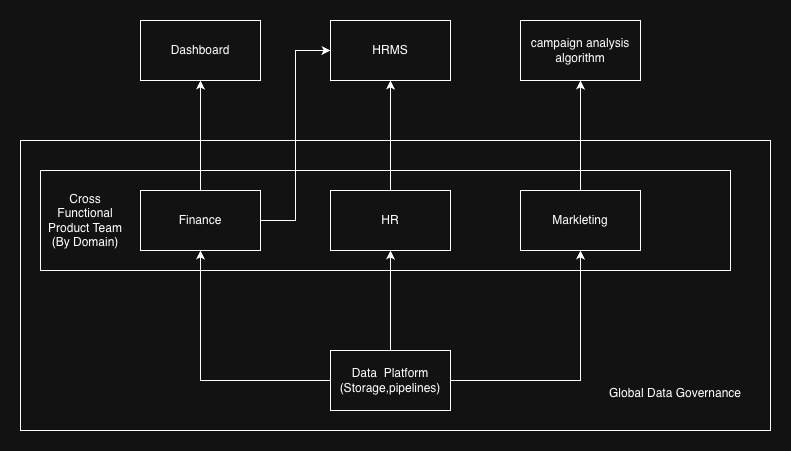

## More Concepts
Before we dive into AWS-specific data tools, I would like to introduce more data engineering terms. These will provide context on what we do as data engineers and how specific tools help solve these problems.

## Data Modeling
Data modeling is the process of visualizing the data structure within an organization. It is usually done in three phases: Conceptual Data Modeling, Logical Data Modeling, and Physical Data Modeling. I will use an e-commerce company as an example to walk through these three phases.

- Conceptual Data Modeling
This is data modeling at a high level. Think like a user or a member of leadership, where technical design is not the focus. For example, we have orders, products, users, and shops. Users go to shops and place orders for products. This is a representation of how the business model works.

- Logical Data Modeling
This is a level deeper than conceptual data modeling. Here, you define the relationships between entities, the attributes that should exist within an entity, and the granularity of an entity (which may involve primary keys and foreign keys). For example, each product should have a product_id as an identifier, a product name, and a price. An order should have an order_id, a foreign key to the products, the quantity, and the total price.

- Physical Data Modeling
This is the actual data modeling that interfaces with the data infrastructure—for example, defining the precise schema or writing the Data Definition Language (DDL) that creates the actual tables. Here, you also consider how and where you will store your data.

## Data Lineage
Data lineage is the trace of how your data is transformed and processed to become the table you see today. Having this trace helps us debug and reproduce data results.

## Schema Evolution

The schema of a source system may change due to new requirements. One of the jobs of a data engineer is to manage these changes, either through manual scripts or, ideally, by using tools that support schema drift.

## Data Profiling and Data Validation

Data Profiling is the process of defining what the data should look like and what it represents. Data Validation ensures that the data passes predefined criteria—essentially a sanity check to ensure no "weird" data makes it into production.

## Data Mesh

Along with data lakes and data warehouses, "Data Mesh" is mentioned quite often, though they are not used in the same context. Data mesh refers to the design of decentralized data governance and accessibility within an organization.

Instinctively, one might think that a data platform should be a single, unified system managed by one data engineering team that handles all modeling and ETL tasks. That approach works fine for small-scale data or simple structures. However, in a company of a certain size, that approach creates a lot of overhead, as every department demands that the data engineering team set up their pipelines. Eventually, the data team becomes a bottleneck, and responsiveness to change becomes extremely slow.

To address this, data mesh design treat data as a product. In this model, different product teams manage their own data. The data engineering team’s job is to manage the underlying data platform and provide guarantees regarding data quality and freshness. Other teams can then use these "data products" to perform their jobs.

Using an e-commerce company as an example:
there could be marketing, finance, and HR teams. Within each, there would be product managers, engineers, and data engineers. They would use a unified data platform where storage, pipelines, and catalogs are managed centrally. Each team, however, builds their own data products to support their specific use cases.

Advantages of this approach include:

Data Ownership: People who are closest to the data manage it, ensuring it is used more effectively.

Scalability: It solves the centralized team bottleneck by allowing multiple teams to work on their own data products.

Collaboration: It makes collaboration easier, as you can go directly to the team that owns the data product rather than relying on a single, overwhelmed team.

One important caveat is that these product teams must agree on centralized data governance guidelines—such as granularity, naming conventions, and access control—to ensure everything remains well-aligned.

## Learn More
[Data modeling](https://www.youtube.com/watch?v=RmugzY84iL4&t=3963s) Great Video to know the basic of Data modeling

[Data Mesh](https://aws.amazon.com/what-is/data-mesh/)
